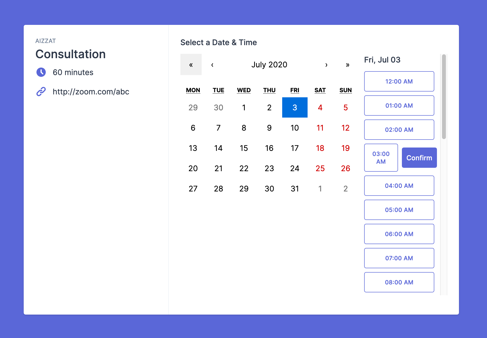

This project was bootstrapped with [Create React App](https://github.com/facebook/create-react-app).

Live demo is available here [https://demo-calend.vercel.app/](https://demo-calend.vercel.app/)

## Available Scripts

In the project directory, you can run:

### `yarn start`

Runs the app in the development mode. Open [http://localhost:3000](http://localhost:3000) to view it in the browser. The page will reload if you make edits. You will also see any lint errors in the console.

### `yarn test`

Launches the test runner in the interactive watch mode. 

### `yarn build`

Builds the app for production to the `build` folder. It correctly bundles React in production mode and optimizes the build for the best performance. The build is minified and the filenames include the hashes. Your app is ready to be deployed!

### `yarn cypress`

To run end-to-end testing using cypress

## What the app is about

It's an app that let you create a sharable link to schedule an event with anyone.

## Tech Features

* React router for routing and protected route
* Stateless component for sharable component
* TailwindCSS for styling
* Styled component for custom styling
* ContextAPI for authenticated user
* Redux to store events data
* Prop-types to validate props properties
* High order component to wrap a List of Event component
* React Portal for Modal usage
* React Hook Form for form validation
* React hook `useState` to manage state in functional component
* Fetch an API in class based component in componentDidMount lifecycle
* Unit testing using React test util
* Cypress for end-to-end testing
* Continuous deployment to vercel
